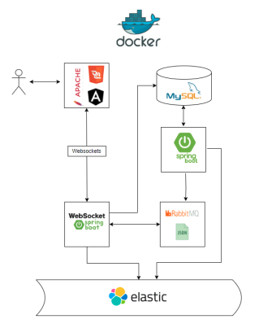
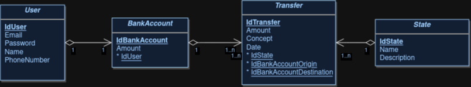
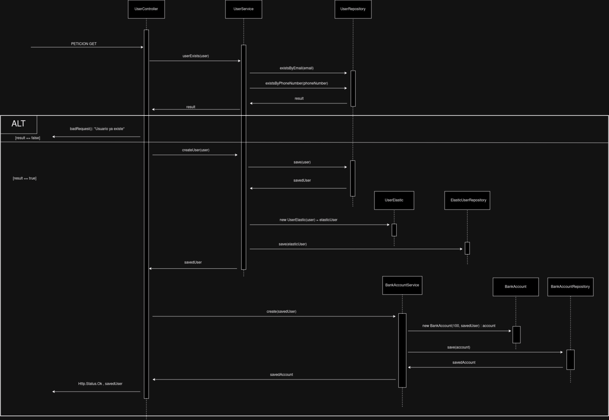

# Pagos-Asincronos

## Equema aplicacion

## Esquema Base de Datos

## Diagramas de secuencia

### Crear Usuario

### Login Usuario

### Crear Transferencia

### Listar Transferencias

## Versiones

* Java -> 11

* Spring Boot con maven -> 2.7.16

* ElasticSearch -> 7.17.14

* RabbitMQ -> 3.8.2

* MySQL -> 8.0.35

* Angular -> 16.2.9

## Direcciones backend

* Conexion -> /ws-endpoint
	
* Login -> /users/login
	
* Registrar -> /users/newUser 
	
* Listar transferencias -> /listTransfer
	
* Crear transferencia -> /app/createdTransfer , canal /topic/newTransfer/{email}

